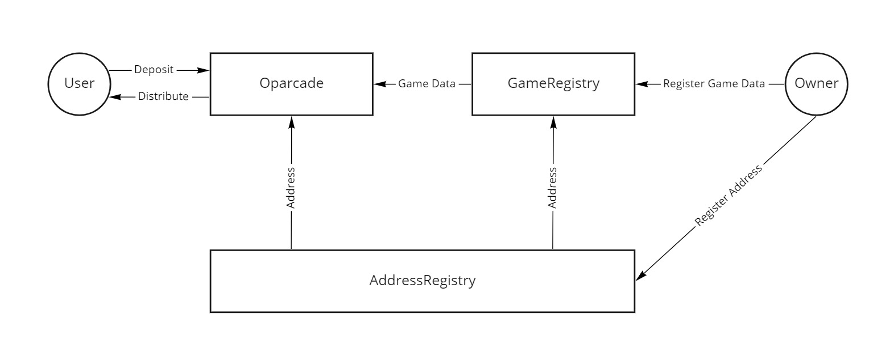

## Oparcade Smart Contract

### Developer instructions

#### Install dependencies
`yarn install`

#### Create .env file and make sure it's having following information:
```
INFURA_KEY = INFURA_KEY
PK = YOUR_PRIVATE_KEY
API_KEY = YOUR_ETHERSCAN_API_KEY
PLATFORM_FEE = WHOLE_NUMBER (0, 1)
```

#### Compile code
- `npx hardhat clean` (Clears the cache and deletes all artifacts)
- `npx hardhat compile` (Compiles the entire project, building all artifacts)

#### Run tests
- `npx hardhat test test/{desired_test_script}`

#### Deploy code 
- `npx hardhat node` (Starts a JSON-RPC server on top of Hardhat Network)
- `npx hardhat run --network {network} scripts/{desired_deployment_script}`

#### Etherscan verification
- `npx hardhat verify --network {network} {deployed_contract_address} {constructor_parameters}`

### How it works


#### Manage Games
** NOTE **: Only owner can manage games.

The first step is to add/remove games users can play.

````solidity
function addGame(string memory _gameName) external onlyOwner returns (uint256 gid);
function removeGame(uint256 _gid) external onlyOwner;
````

The second step is to add tokens available for the deposit of each game.

````solidity
function updateDepositTokenAmount(
    uint256 _gid,
    address _token,
    uint256 _amount
) external onlyOwner;
````

The third step is to add tokens available for the claim of each game.

````solidity
function updateDistributableTokenAddress(
    uint256 _gid,
    address _token,
    bool _isDistributable
) external onlyOwner;
````

#### Deposit and Claim tokens

The first step is for users to deposit tokens for the game. Only registered tokens can be used for the deposit.

````solidity
function deposit(uint256 _gid, address _token) external;
````

The second step is for winners to claim their prize from the game. Only registered tokens can be used for the claim.

````solidity
function claim(
    uint256 _gid,
    address _winner,
    address _token,
    uint256 _amount,
    uint256 _nonce,
    bytes calldata _signature
) external;
````
